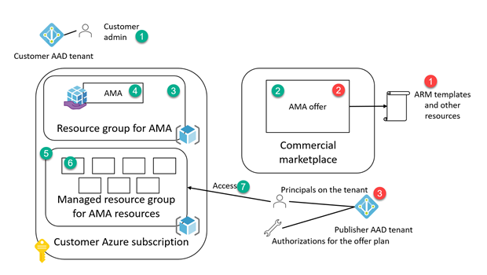
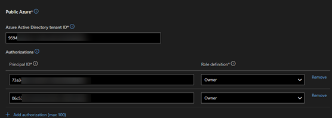

# Out of band delivery of bits to an Azure Managed Application (AMA) plan deployed from Microsoft Commercial Marketplace

Often times publisher wants to deliver additional bits to an AMA deployment after the customer successfully installs the application, such as configuration files, actual installation files, or any other assets.

Here, we will show a method for getting those delivered using the notification endpoints.

## Anatomy of an AMA

Let's first start with the details of an AMA.

The red steps (on the right hand side of the diagram below, 1 through 3) are for the publisher side, and the green steps (on the left side of the diagram, 1 through 4) are for the customer's experience.



### Publisher side

We are covering only the relevant portion of the steps here. Please see the [official documentation](https://learn.microsoft.com/en-us/azure/marketplace/plan-azure-app-managed-app) for a full set of steps.
 
 1. Publisher creates the assets (minimum, the ARM template, and createUIDefinition.json file), and puts in a compressed file (zip).
 2. Publisher creates an AMA offer, and corresponding plan, uploads the package to the plan
 3. Publisher adds principal ids to the authorizations list. These principals can be groups, users or application registrations. We recommend using groups for these, and manage the group memberships through Azure Active Directory (AAD).

 ### Customer side

 1. Customer logs on to Azure portal
 2. Customer finds the AMA offer on commercial marketplace
 3. Customer designates a resource group for the AMA
 4. AMA is created on the managed application resource group
 5. A separate resource group (managed resource group) is created
 6. The resources defined in the ARM template are deployed
 7. The principals defined in step 3 by the publisher can access the managed resource group

 ## Delivering assets to the deployment

 There can be two different methods for achieving this goal.
 1. [Access the deployment directly](#accessing-the-deployment-directly), using the primary feature of Azure Managed Applications
 2. Include code to [pull assets after the deployment](#solution-pulling-in-the-assets-after-deployment).

 We will be covering (1) in the sections below, and will later add (2). This is the native capability of the managed applications. They allow the publisher to access the environment directly and manage them. We will describe the details in the following sections.

 The high level steps for achieving (1) are:

 1- [Configure the plan properties for receiving notifications](#getting-notifications-for-the-deployments)

 2- [Configure authorizations](#configuring-authorizations)

 3- [Accessing the deployment](#accessing-the-deployment)

## Accessing the deployment directly

### Getting notifications for the deployments 

During the definition of the AMA's plan, the technical configuration step has a setting for a "Notification Endpoint URL". The publisher can add a URI to listen on the deployments of AMAs by customers.


For receiving the notification, you need to expose an endpoint accessible from the internet. Your endpoint URL must end with "resources", for example, you need to do following to be able to receive notifications:

- If you enter "https://mycompanyapp.com/api" for the Notification Endpoint URL
- You need listen on https://mycompanyapp.com/api/resources"

You can use a tunnelling solution such as ngrok.io, or [Visual Studio dev tunnels](https://learn.microsoft.com/en-us/connectors/custom-connectors/port-tunneling) for local development and debugging.

### Configuring authorizations 

Right below the "Notification Endpoint URL" field is the "Authorizations" section for each cloud you are publishing to.

You need to add Principal IDs (object IDs for users and groups, and principal ID for service principals of application registrations) to this list with the corresponding roles. We recommend to use AAD groups, and add other objects to those groups on your AAD groups blade.



### Accessing the deployment

Let's briefly go through the steps for accessing the deployment using Azure CLI. 

1. [Receive notification](#receive-notification)
2. [Login using the credentials for the principal listed on the authorizations](#login-using-the-credentials-for-the-principal-listed-on-the-authorizations)
3. [Access managed resource group](#access-managed-resource-group)
4. [Upload assets to the storage account](#upload-assets-to-the-storage-account)

### Receive notification

The notification payload will look like the following:

```json
{
  "eventType": "PUT",
  "provisioningState": "Succeeded",
  "plan": {
    "name": "amalistener",
    "product": "erccontosoamagpts-preview",
    "publisher": "test_test_gptsmarketplace1633637382363",
    "version": "1.0.0"
  },
  "applicationId": "/subscriptions/bf9d65ed-6bb8-4ebd-9a81-d36cdf24cf4e/resourceGroups/ManagedApplications/providers/microsoft.solutions/applications/ercgptsama1",
  "eventTime": "2023-01-10T16:52:02.2020401Z"
}

```
Please notice the `applicationId` property. We will talk about it more in the following section for accessing the deployment.

Once you receive the notification of a successfully deployment, then you can access the deployment with those authorized principals.

### Login using the credentials for the principal listed on the authorizations
```sh
az login --scope https://management.core.windows.net//.default --allow-no-subscriptions

### Access the managed application properties

az managedapp show --ids /subscriptions/bf9d65ed-6bb8-4ebd-9a81-d36cdf24cf4e/resourceGroups/ManagedApplications/providers/microsoft.solutions/applications/ercgptsama1
```
 For example, after logging on using a principal in the authorizations list, and calling GET operation on the application like above, will give you the following result.

 ```json
{
  "id": "/subscriptions/bf9d65ed-6bb8-4ebd-9a81-d36cdf24cf4e/resourceGroups/ManagedApplications/providers/microsoft.solutions/applications/ercgptsama1",
  "kind": "MarketPlace",
  "location": "westus3",
  "name": "ercgptsama1",
  "plan": {
    "name": "amalistener",
    "product": "erccontosoamagpts-preview",
    "publisher": "test_test_gptsmarketplace1633637382363",
    "version": "1.0.0"
  },
  "properties": {
    "authorizations": [
      {
        "principalId": "73a34422-b5df-4ff1-92f8-f693949995d1",
        "roleDefinitionId": "8e3af657-a8ff-443c-a75c-2fe8c4bcb635"
      },
      {
        "principalId": "06c53f7f-c6a9-4a2f-b435-c2647b2ce866",
        "roleDefinitionId": "8e3af657-a8ff-443c-a75c-2fe8c4bcb635"
      }
    ],
    "createdBy": {
      "applicationId": "c44b4083-3bb0-49c1-b47d-974e53cbdf3c",
      "oid": "df30a7e0-98dc-41a6-afa6-d1ddea551529",
      "puid": "10033FFFA7593A0D"
    },
    "customerSupport": {
      "contactName": "Ercenk Keresteci",
      "email": "ercenk@microsoft.com",
      "phone": "14255381196"
    },
    "managedResourceGroupId": "/subscriptions/bf9d65ed-6bb8-4ebd-9a81-d36cdf24cf4e/resourceGroups/mrg-erccontoso-20230110084736",
    "managementMode": "Managed",
    "outputs": {
      "hostname": {
        "type": "String",
        "value": "ercgptsama1.westus3.cloudapp.azure.com"
      }
    },
    "parameters": {
      "adminPassword": {
        "type": "SecureString"
      },
      "adminUsername": {
        "type": "String",
        "value": "ercadmin"
      },
      "dnsLabelPrefix": {
        "type": "String",
        "value": "ercgptsama1"
      },
      "location": {
        "type": "String",
        "value": "westus3"
      },
      "vmSize": {
        "type": "String",
        "value": "Standard_D2_v3"
      },
      "windowsOSVersion": {
        "type": "String",
        "value": "2016-Datacenter"
      }
    },
    "provisioningState": "Succeeded",
    "publisherTenantId": "9594bc9b-0c11-401a-af25-635a704e250a",
    "supportUrls": {
      "publicAzure": "https://privacy.microsoft.com/en-us/privacystatement"
    },
    "updatedBy": {
      "applicationId": "c44b4083-3bb0-49c1-b47d-974e53cbdf3c",
      "oid": "df30a7e0-98dc-41a6-afa6-d1ddea551529",
      "puid": "10033FFFA7593A0D"
    }
  },
  "type": "microsoft.solutions/applications"
}

 ```

### Access managed resource group

You can use `az group show` to display the properties of the managed resource group by using the value from the `managedResourceGroupId` property above. In this example we can issue the following command to display the resource group properties.
``` sh
az group show --name mrg-erccontoso-20230110084736
```

Then you can use the following command to list the resources on the corresponding managed resource group using the `managedResourceGroupID` property.

```sh
 az rest --method GET --uri https://management.azure.com/subscriptions/bf9d65ed-6bb8-4ebd-9a81-d36cdf24cf4e/resourceGroups/mrg-erccontoso-20230110084736/resources?api-version=2021-04-01

```

Alternatively, you can use a native command on Azure CLI as follows:
```sh
az resource list --resource-group mrg-erccontoso-20230110084736
```

Resulting in:

```json
{
  "value": [
    {
      "id": "/subscriptions/bf9d65ed-6bb8-4ebd-9a81-d36cdf24cf4e/resourceGroups/mrg-erccontoso-20230110084736/providers/Microsoft.Network/networkSecurityGroups/default-NSG",
      "location": "westus3",
      "name": "default-NSG",
      "type": "Microsoft.Network/networkSecurityGroups"
    },
    {
      "id": "/subscriptions/bf9d65ed-6bb8-4ebd-9a81-d36cdf24cf4e/resourceGroups/mrg-erccontoso-20230110084736/providers/Microsoft.Storage/storageAccounts/kk676c4bcm5gisawinvm",
      "kind": "Storage",
      "location": "westus3",
      "name": "kk676c4bcm5gisawinvm",
      "sku": {
        "name": "Standard_LRS",
        "tier": "Standard"
      },
      "tags": {},
      "type": "Microsoft.Storage/storageAccounts"
    },
    {
      "id": "/subscriptions/bf9d65ed-6bb8-4ebd-9a81-d36cdf24cf4e/resourceGroups/mrg-erccontoso-20230110084736/providers/Microsoft.Network/publicIPAddresses/myPublicIP",
      "location": "westus3",
      "name": "myPublicIP",
      "sku": {
        "name": "Basic"
      },
      "type": "Microsoft.Network/publicIPAddresses"
    },
    {
      "id": "/subscriptions/bf9d65ed-6bb8-4ebd-9a81-d36cdf24cf4e/resourceGroups/mrg-erccontoso-20230110084736/providers/Microsoft.Network/virtualNetworks/MyVNET",
      "location": "westus3",
      "name": "MyVNET",
      "type": "Microsoft.Network/virtualNetworks"
    },
    {
      "id": "/subscriptions/bf9d65ed-6bb8-4ebd-9a81-d36cdf24cf4e/resourceGroups/mrg-erccontoso-20230110084736/providers/Microsoft.Network/networkInterfaces/myVMNic",
      "location": "westus3",
      "name": "myVMNic",
      "type": "Microsoft.Network/networkInterfaces"
    },
    {
      "id": "/subscriptions/bf9d65ed-6bb8-4ebd-9a81-d36cdf24cf4e/resourceGroups/mrg-erccontoso-20230110084736/providers/Microsoft.Compute/virtualMachines/SimpleWinVM",
      "identity": {
        "principalId": "ae133155-8dae-4c7a-99d9-e6e9a973063a",
        "tenantId": "72f988bf-86f1-41af-91ab-2d7cd011db47",
        "type": "SystemAssigned"
      },
      "location": "westus3",
      "name": "SimpleWinVM",
      "type": "Microsoft.Compute/virtualMachines"
    },
    {
      "id": "/subscriptions/bf9d65ed-6bb8-4ebd-9a81-d36cdf24cf4e/resourceGroups/MRG-ERCCONTOSO-20230110084736/providers/Microsoft.Compute/disks/SimpleWinVM_OsDisk_1_856357c920ad4fcf97350c176a7d1e3d",
      "location": "westus3",
      "managedBy": "/subscriptions/bf9d65ed-6bb8-4ebd-9a81-d36cdf24cf4e/resourceGroups/mrg-erccontoso-20230110084736/providers/Microsoft.Compute/virtualMachines/SimpleWinVM",
      "name": "SimpleWinVM_OsDisk_1_856357c920ad4fcf97350c176a7d1e3d",
      "sku": {
        "name": "Standard_LRS",
        "tier": "Standard"
      },
      "type": "Microsoft.Compute/disks"
    },
    {
      "id": "/subscriptions/bf9d65ed-6bb8-4ebd-9a81-d36cdf24cf4e/resourceGroups/MRG-ERCCONTOSO-20230110084736/providers/Microsoft.Compute/disks/SimpleWinVM_disk2_d991337da59149c0a15c8f3e0956328f",
      "location": "westus3",
      "managedBy": "/subscriptions/bf9d65ed-6bb8-4ebd-9a81-d36cdf24cf4e/resourceGroups/mrg-erccontoso-20230110084736/providers/Microsoft.Compute/virtualMachines/SimpleWinVM",
      "name": "SimpleWinVM_disk2_d991337da59149c0a15c8f3e0956328f",
      "sku": {
        "name": "Standard_LRS",
        "tier": "Standard"
      },
      "type": "Microsoft.Compute/disks"
    },
    {
      "id": "/subscriptions/bf9d65ed-6bb8-4ebd-9a81-d36cdf24cf4e/resourceGroups/MRG-ERCCONTOSO-20230110084736/providers/Microsoft.Compute/virtualMachines/SimpleWinVM/extensions/MicrosoftMonitoringAgent",
      "location": "westus3",
      "name": "SimpleWinVM/MicrosoftMonitoringAgent",
      "type": "Microsoft.Compute/virtualMachines/extensions"
    }
  ]
}

```
### Upload assets to the storage account
We can now use the Azure Storage Account commands to upload assets with the command below.

```sh
az storage blob upload \
    --account-name <storage-account> \
    --container-name <container> \
    --name helloworld \
    --file helloworld \
    --auth-mode login
```

## Solution pulling in the assets after deployment

You can include a bootstrapping code to the assets you deploy, if no resource is present for code to run, an alternative can be deploying a Virtual Machine, and code deleting the VM after it runs.

This technique is possible through the [Azure Instance Metadata Service (IMDS)](https://learn.microsoft.com/en-us/azure/virtual-machines/linux/instance-metadata-service?tabs=windows) and system assigned managed identities.

The deployment template needs to include a section that gives reader permission to the resource group. See this [example](https://github.com/Ercenk/commercial-marketplace-managed-application-metering-samples/blob/15b3cb81761321eb4199ce9827b3d037b5286df3/src/system-assigned/mainTemplate.json#L219-L232) for how to implement this.

Assuming there is a Virtual Machine, with a system assigned managed identity, and the MI has read access to the managed resource group, you can then get the status of the deployment using the Azure REST APIs, and upon successful deployment, the code can pull in the assets.

Here is an example of how you can get an access token from the IMDS and call Azure management APIs.

```powershell
# Get access token from the metadata endpoint
$managementTokenUrl = "http://169.254.169.254/metadata/identity/oauth2/token?api-version=2018-02-01&resource=https%3A%2F%2Fmanagement.azure.com%2F"
$Token = Invoke-RestMethod -Headers @{"Metadata" = "true"} -Uri $managementTokenUrl 

# Call the metadata endpoint again to get the subscription and the resource group
$Headers = @{}
$Headers.Add("Authorization","$($Token.token_type) "+ " " + "$($Token.access_token)")
$metadataUrl = "http://169.254.169.254/metadata/instance?api-version=2019-06-01"
$metadata = Invoke-RestMethod -Headers @{'Metadata'='true'} -Uri $metadataUrl

# Get the details of the resource group
$managementUrl = "https://management.azure.com/subscriptions/" + $metadata.compute.subscriptionId + "/resourceGroups/" + $metadata.compute.resourceGroupName + "?api-version=2019-10-01"
$resourceGroupInfo = Invoke-RestMethod -Headers $Headers -Uri $managementUrl

```

You can then call the following REST APIs first to [get the deployments](https://learn.microsoft.com/en-us/rest/api/resources/deployments/list-by-resource-group) on this resource group using the REST API.
```
GET https://management.azure.com/subscriptions/{subscriptionId}/resourcegroups/{resourceGroupName}/providers/Microsoft.Resources/deployments/?api-version=2021-04-01
```

```powershell
# Get the details of the deployments
$deploymentsUrl = "https://management.azure.com/subscriptions/" + $metadata.compute.subscriptionId + "/resourceGroups/" + $metadata.compute.resourceGroupName/providers/Microsoft.Resources/deployments/?api-version=2021-04-01 + "?api-version=2021-04-01"
$deployments = Invoke-RestMethod -Headers $Headers -Uri $deploymentsUrl
```

The code can iterate through the returned deployments, find the relevant one, and check the [`ProvisioningState`](https://learn.microsoft.com/en-us/rest/api/resources/deployments/list-by-resource-group#provisioningstate) property's value if it is "Succeeded".

If the deployment is successful, then the code can proceed to pull in additional assets.

A good measure to take is to ensure the deployment indeed succeeded by checking the notification received in the endpoint, before allowing the assets to be pulled in. Please see the relevant section on how to receive the notification.
